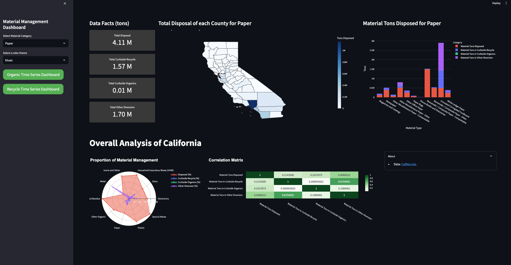

# Material Waste Management Dashboard

## [Deploy Dashboard Visualization Link](https://wastedisposal.streamlit.app/)
## [Presentation](https://www.canva.com/design/DAGHZk_FiS8/ykgocL3F8w5j1ritsUq1bg/view?utm_content=DAGHZk_FiS8&utm_campaign=designshare&utm_medium=link&utm_source=editor)

## Inspiration
This project provides an in-depth analysis of California's waste characterization data, categorized by county.

The aim is to understand the waste composition and identify key trends and areas for improvement.

Data Source:  https://www2.calrecycle.ca.gov/WasteCharacterization/MaterialTypeStreams?bg=116

## Benefits of Dashboard
- Dashboards provide real-time visualization of waste disposal data.

- Immediate insights into waste management performance and areas for improvement.

- Identify trends and patterns in waste generation and disposal.

- Evaluate the impact of specific policies and programs on waste management.

- Make data-driven adjustments to improve outcomes.

- Use visualizations to educate and inform the community about waste management practices.

## Tech Stack
- streamlit
- pandas
- altair
- plotly
- tableu
